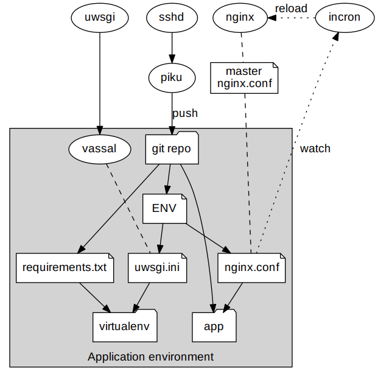

# piku

The tiniest Heroku/CloudFoundry-like PaaS you've ever seen, inspired by [dokku][dokku].

## Motivation

I kept finding myself wanting an Heroku/CloudFoundry-like way to deploy stuff on a few remote ARM boards and [my Raspberry Pi cluster][raspi-cluster], but since [dokku][dokku] still doesn't work on ARM and even `docker` can be overkill sometimes, I decided to roll my own.

## Project Status/To Do:

This is currently being used for production deployments of http://taoofmac.com and a few other projects of mine. Regardless, there is still room for improvement:

From the bottom up:

- [ ] Prebuilt Raspbian image with everything baked in
- [ ] `chroot`/namespace isolation (tentative)
- [ ] Relay commands to other nodes
- [ ] Proxy deployments to other nodes (build on one box, deploy to many) 
- [ ] Support Clojure/Java deployments through `boot` or `lein` 
- [ ] Support Node deployments
- [ ] Sample Go app
- [ ] Support Go deployments (in progress)
- [ ] nginx SSL optimization/cypher suites, own certificates
- [ ] Let's Encrypt support
- [ ] Review deployment messages
- [ ] Review docs/CLI command documentation
- [x] Allow setting `nginx` IP bindings in `ENV` file (`NGINX_IPV4_ADDRESS` and `NGINX_IPV6_ADDRESS`)
- [x] Cleanups to remove 2.7 syntax internally
- [x] Change to Python 3 runtime as default, with `PYTHON_VERSION = 2` as fallback
- [x] Run in Python 3 only
- [x] (experimental) REPL in `feature/repl`
- [x] Python 3 support through `PYTHON_VERSION = 3`
- [x] static URL mapping to arbitrary paths (hat tip to @carlosefr for `nginx` tuning)
- [x] remote CLI (requires `ssh -t`)
- [x] saner uWSGI logging
- [x] `gevent` activated when `UWSGI_GEVENT = <integer>` 
- [x] enable CloudFlare ACL when `NGINX_CLOUDFLARE_ACL = True` 
- [x] Autodetect SPDY/HTTPv2 support and activate it
- [x] Basic nginx SSL config with self-signed certificates and UNIX domain socket connection
- [x] nginx support - creates an nginx config file if `NGINX_SERVER_NAME` is defined
- [x] Testing with pre-packaged [uWSGI][uwsgi] versions on Debian Jessie (yes, it was painful)
- [x] Support barebones binary deployments
- [x] Complete installation instructions (see `INSTALL.md`, which also has a draft of Go installation steps)
- [x] Installation helper/SSH key setup
- [x] Worker scaling 
- [x] Remote CLI commands for changing/viewing applied/live settings
- [x] Remote tailing of all logfiles for a single application
- [x] HTTP port selection (and per-app environment variables)
- [x] Sample Python app
- [X] `Procfile` support (`wsgi` and `worker` processes for now, `web` processes being tested)
- [x] Basic CLI commands to manage apps
- [x] `virtualenv` isolation
- [x] Support Python deployments
- [x] Repo creation upon first push
- [x] Basic understanding of [how `dokku` works](http://off-the-stack.moorman.nu/2013-11-23-how-dokku-works.html)

## Using `piku`

`piku` supports a Heroku-like workflow, like so:

* Create a `git` SSH remote pointing to `piku` with the app name as repo name (`git remote add paas piku@server:app1`) 
* `git push paas master` your code
* `piku` determines the runtime and installs the dependencies for your app (building whatever's required)
    * For Python, it segregates each app's dependencies into a `virtualenv`
    * For Go, it defines a separate `GOPATH` for each app
* It then looks at a `Procfile` and starts the relevant workers using [uWSGI][uwsgi] as a generic process manager
* You can then remotely change application settings (`config:set`) or scale up/down worker processes (`ps:scale`) at will.

## Internals

This is an illustrated example of how `piku` works for a Python deployment:

## Supported Platforms

`piku` is intended to work in any POSIX-like environment where you have Python, [uWSGI][uwsgi] and SSH, i.e.: 
Linux, FreeBSD, [Cygwin][cygwin] and the [Windows Subsystem for Linux][wsl].

As a baseline, this is currently being developed on an original, 256MB Rasbperry Pi Model B.

Since I have an ODROID-U2, [a bunch of Pi 2s][raspi-cluster] and a few more ARM boards on the way, it will be tested on a number of places where running `x64` binaries is unfeasible.

But there are already a few folk using `piku` on vanilla `x64` Linux without any issues whatsoever, so yes, you can use it as a micro-PaaS for 'real' stuff. Your mileage may vary.

## Supported Runtimes

`piku` will support deploying apps written in Python, Go, Clojure (Java) and Node (see [above](#project-statustodo)).

## FAQ

**Q:** Why `piku`?

**A:** Partly because it's supposed to run on a [Pi][pi], because it's Japanese onomatopeia for 'twitch' or 'jolt', and because I know the name will annoy some of my friends.

**Q:** Why Python/why not Go?

**A:** I actually thought about doing this in Go right off the bat, but [click][click] is so cool and I needed to have [uWSGI][uwsgi] running anyway, so I caved in. But I'm very likely to take something like [suture](https://github.com/thejerf/suture) and port this across, doing away with [uWSGI][uwsgi] altogether.

**Q:** Does it run under Python 3?

**A:** It should. `click` goes a long way towards abstracting the simpler stuff, and I tried to avoid most obvious incompatibilities (other than a few differences in `subprocess.call` and the like). However, this targets Python 2.7 first, since that's the default on Raspbian. Pull requests are welcome.

**Q:** Why not just use `dokku`?

**A:** I use `dokku` daily, and for most of my personal stuff. But the `dokku` stack relies on a number of `x64` containers that need to be completely rebuilt for ARM, and when I decided I needed something like this (March 2016) that was barely possible - `docker` itself is not fully baked for ARM yet, and people are still trying to get `herokuish` and `buildstep` to build on ARM.

[click]: http://click.pocoo.org
[pi]: http://www.raspberrypi.org
[dokku]: https://github.com/dokku/dokku
[raspi-cluster]: https://github.com/rcarmo/raspi-cluster
[cygwin]: http://www.cygwin.com
[uwsgi]: https://github.com/unbit/uwsgi
[wsl]: https://en.wikipedia.org/wiki/Windows_Subsystem_for_Linux
